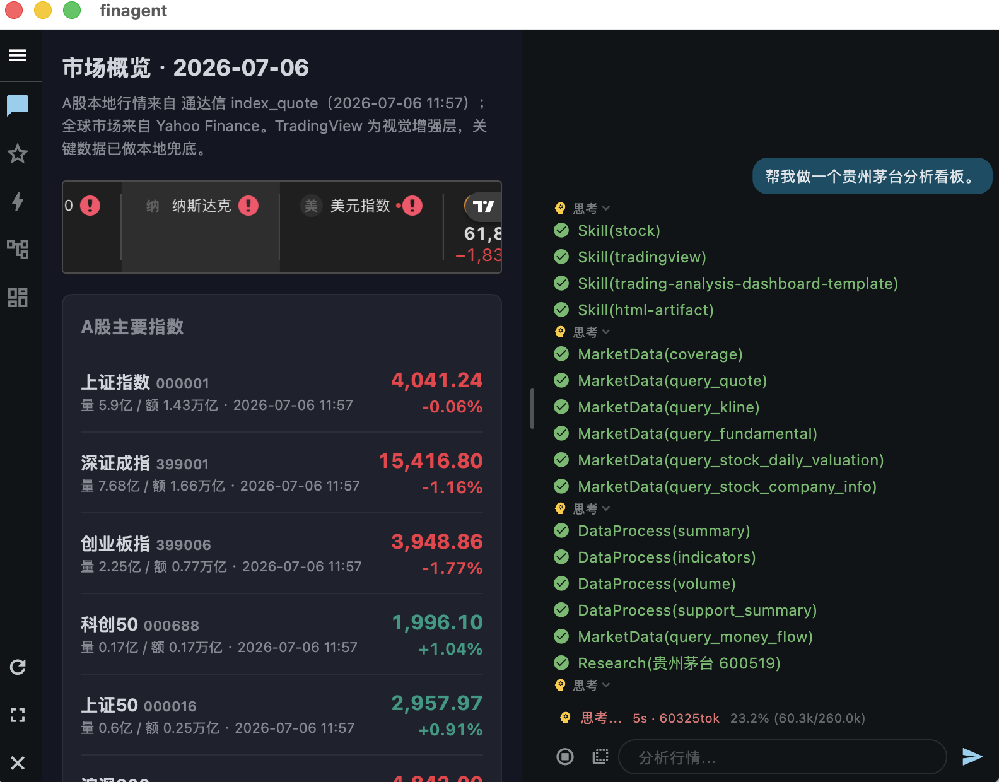

# FinAgent Mobile

This repository is also a study and research project on agent systems running on mobile devices. The finance workflows are the main testbed for exploring how a mobile agent can use local context, governed data, tools, UI surfaces, and human approval to complete real user workflows on-device.

FinAgent Mobile is a Flutter mobile agent. Its primary bundled domain is finance: local market research, data-backed analysis, watchlists, dashboards, strategy review, and simulated-trading workflows.

## Abilities

- Mobile agent runtime: chat, sessions, memory, tool use, WebView/dashboard interaction, approvals, resumable workflow evidence, and app-started workflow tests for real UI behavior.
- Finance data layer: governed interfaces for quote, K-line, fund, macro, news, provider health, source time versus fetch time, local readback, cache-first reuse, and provider failure classification.
- Market and investment analysis: market overview, stock research, fund research, watchlists, macro/news context, risk notes, and user-facing reports backed by tool evidence.
- Strategy and backtest: built-in indicators and strategies, custom StrategySpec validation, backtest execution, saved strategy lifecycle, rerun evidence, and watchlist/monitor handoff.
- UI artifacts: dashboards, generated WebView reports, strategy views, macro evidence panels, and provenance text that explains provider, cache, time, and missing data.
- Trading boundary: simulated-trading workflows and paper evidence are supported; real broker execution is outside the default mobile safety boundary.

## Demonstration



## What You Can Ask

- Using available local or configured provider data, what is driving today’s A-share market, and which risks should I watch?
- Analyze 600519 using the latest available price and fundamentals, and state the data sources and freshness.
- Screen A-share stocks for profitable, reasonably valued candidates, and explain the data coverage and main risks.
- Backtest an RSI and volume strategy for 600519 without saving it.
- Compare RSI and moving-average strategies for 600519, including return, drawdown, and data coverage.
- Rerun my saved 600519 strategy and explain why its metrics changed from the previous run.
- Compare funds 110011 and 000083 using available performance and holdings data, and explain the main risks.
- Which of funds 110011 and 000083 better fits a lower-risk portfolio based on available NAV, drawdown, and holdings evidence?

## Quick Start

Install Flutter, then run:

```bash
flutter pub get
flutter run -d macos
```

For Android:

```bash
flutter run -d android
```

## Runtime Settings

The app needs runtime settings before the agent can run real workflows. Configure them in the app settings UI or in the runtime configuration directory created by the app. Do not commit local credentials.

Minimum model settings:

- LLM provider, base URL, model, and API key.
- Recommended default: a vision-capable model for normal agent workflows, because UI/screenshot/dashboard and visual evidence workflows may need image understanding. Use a text-only model only for text-only smoke tests or workflows that do not inspect images.
- Optional LLM HTTP user-agent header when the selected provider requires one.

Finance data settings:

- Provider credentials only for providers you intend to use. A personal research finance agent usually fails first on data access, not on the LLM: the hard work is retrieving data, proving the provider returned the expected schema, preserving source time separately from fetch time, and reusing verified local rows before spending another external call.
- Data source options such as Wind, Tushare, search providers, Xueqiu simulated trading, Yahoo Finance, and TradingView.
- TDX and EastMoney public data: practical A-share sources for quote, K-line, sector, hot-rank, limit-pool, money-flow, and related market structure data. Treat transport failures and provider schema changes as source-health evidence, not silent fallbacks.
- Wind / AIFinMarket: configure `WIND_API_KEY` only if you have access from Wind AIFinMarket. Use it for licensed professional data, macro series, documents, and advanced finance facts; quota and permission limits are provider-owned and should be visible in API health.
- Tushare: configure `TUSHARE_TOKEN` from a Tushare account when you need supported A-share reference data. Some statement/fund endpoints require extra permissions; unsupported or permission-gated endpoints should stay disabled instead of being advertised as normal workflows.
- Search providers: configure only the search engines you actually use. They provide research context and source discovery, not canonical market-data tables.
- Xueqiu simulated trading: configure cookies/session data only for simulated-trading validation. Keep it separate from real broker execution and refresh cookies outside source control.
- Yahoo Finance / yfinance-style data: mobile uses direct Yahoo-compatible paths for global quote/history/research where available. It normally needs global web access or a working proxy.
- TradingView: use it as a visual/chart enhancement layer when web access is available; it is not the canonical storage source for reusable data.
- Optional local proxy settings when your network requires them.
- Global web access or a working proxy for providers that depend on overseas web services, especially yfinance/Yahoo Finance and TradingView.
- Runtime data directory for sessions, memory, generated dashboards, local cache, provider evidence, logs, and user-created artifacts.

Data-source comparison:

| Source group | Best use | Main boundary | Provenance treatment |
|---|---|---|---|
| TDX native | A-share quote, K-line, index, transactions, tick, and market-structure evidence | Public servers can be unavailable or schema-specific | Persist only registered schemas; preserve provider as-of time and classify transport failures. |
| EastMoney public routes | A-share/fund public data, sectors, rankings, money flow, limit pools, and hot lists | Route and field names can drift | Normalize through code-owned interfaces and keep failure evidence visible. |
| Wind / AIFinMarket | Licensed professional, macro, fundamental, document, and advanced finance data | Credential, quota, and permission gated | Prefer cache/readback first; expose quota and permission status before live refresh. |
| Tushare Pro | Structured A-share reference data when the token has permission | Endpoint permissions vary by account | Disable unsupported endpoints and avoid retry loops after permission failure. |
| Yahoo Finance compatible routes | Global instruments, cross-market context, history, options, actions, and news | Needs global web access or proxy; not an A-share primary source | Use for global context and typed readbacks; do not replace primary China-market providers. |
| Search and research pages | Narrative explanation, macro attribution, and source discovery | Not automatically canonical market data | Treat as hypothesis/evidence rows unless promoted to a governed schema. |

Credential and access matrix:

| Data source | Key required | Where to get / configure | Main use |
|---|---|---|---|
| TDX native public market data | No API key | Bundled native protocol/provider policy | A-share quote, K-line, index and market-structure paths; network/server availability still matters. |
| EastMoney public data | No API key | Public EastMoney routes | A-share, ETF, sector, hot-rank, flow, limit-pool and related public data. |
| Wind / AIFinMarket | `WIND_API_KEY` | Wind AIFinMarket / Wind account or portal | Professional, macro, fundamental, document and advanced finance data; quota and permission gated. |
| Tushare Pro | `TUSHARE_TOKEN` | Tushare account -> personal center -> account token | Structured A-share reference data; endpoint permissions vary by account. |
| Yahoo Finance / yfinance-style global data | No API key in this app | Public Yahoo/yfinance-compatible routes used directly by the mobile runtime | Global quote/history/research/options/actions; usually needs global web access or proxy. |
| TradingView visual/chart layer | No API key in this app | Web access / embedded chart resources | Visual chart enhancement, not canonical persisted data. |
| Brave Search | `BRAVE_SEARCH_KEY` | Brave Search API dashboard | Research/source discovery, not canonical market data. |
| Tavily Search | `TAVILY_API_KEY` | Tavily Platform dashboard | Research/source discovery and extraction, not canonical market data. |
| FRED macro data | `FRED_API_KEY` | FRED account API key page | Official US macro/rates series. |
| BLS public macro data | No API key in current implementation | BLS public API / public releases | US labor/inflation evidence; rate limits and source availability still apply. |
| BEA macro data | `BEA_API_KEY` or `~/.fin_electron/bea.txt` fallback | BEA API signup | US national accounts and growth evidence. |
| EIA energy data | `EIA_API_KEY` | EIA Open Data API registration | Energy inventory/commodity macro evidence. |
| Xueqiu simulated trading | `XQ_COOKIE`; optional `XQ_PORTFOLIO` | Logged-in Xueqiu browser session and simulation group ids/names | Simulation validation only; keep separate from real broker execution. |
| Public macro/research pages | Usually no API key | Official/public pages; sometimes browser/manual validation | Research narrative and attribution evidence until promoted into governed schema. |

Service dependencies:

- Flutter runtime for desktop or device execution.
- External finance providers may require network access, credentials, quota, cookies, or provider accounts.
- Missing credentials should block only the credentialed provider path; local readback and public-source workflows should remain usable.

Runtime data such as sessions, dashboards, generated reports, logs, cache, memory, cookies, and API keys belongs outside this repository.

## Design Guides

Design guides are part of the source contract. They are added as the corresponding code domains appear. When a design guide is added or materially changed, update both `README.md` and `README.zh.md` in the same source-change commit so the README describes the code at that point in history.

English:

- `docs/design/agent/agent-design-guide.md`
- `docs/design/data-provenance/data-provenance-design-guide.md`
- `docs/design/strategy-provenance/strategy-provenance-design-guide.md`
- `docs/design/workflow-phase/workflow-phase-design-guide.md`

Chinese:

- `docs/design/agent/agent-design-guide.zh.md`
- `docs/design/data-provenance/data-provenance-design-guide.zh.md`
- `docs/design/strategy-provenance/strategy-provenance-design-guide.zh.md`
- `docs/design/workflow-phase/workflow-phase-design-guide.zh.md`

## Development

Validate locally:

```bash
flutter analyze
flutter test
```

If this snapshot reports inherited lint warnings, use a non-fatal analyzer pass to separate real analyzer errors from style debt:

```bash
flutter analyze --no-fatal-infos --no-fatal-warnings
```

## Repository Layout

```text
assets/finance/ Bundled agent instructions, skills, dashboards, and fixtures
docs/design/ Bilingual design guides, added as the related code domains appear
lib/ Flutter app, agent runtime, domain code, and UI code
test/ Unit, widget, and workflow-oriented regression tests
scripts/ Developer scripts for local validation and maintenance
```

## Safety Boundary

This project is for research, education, and workflow assistance. It does not provide investment advice. Trading-related workflows must keep simulated and real broker paths separate, require explicit approval for side effects, and record the evidence used for each decision.

Do not commit API keys, cookies, tokens, local proxy settings, runtime sessions, or generated data into this repository.

## License

Apache License 2.0. See `LICENSE`.
